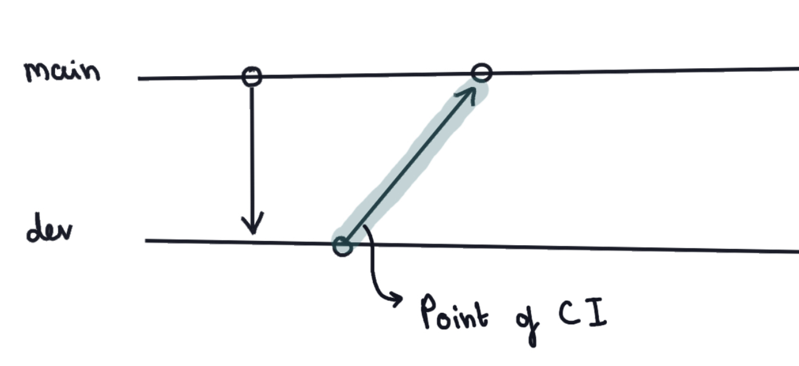
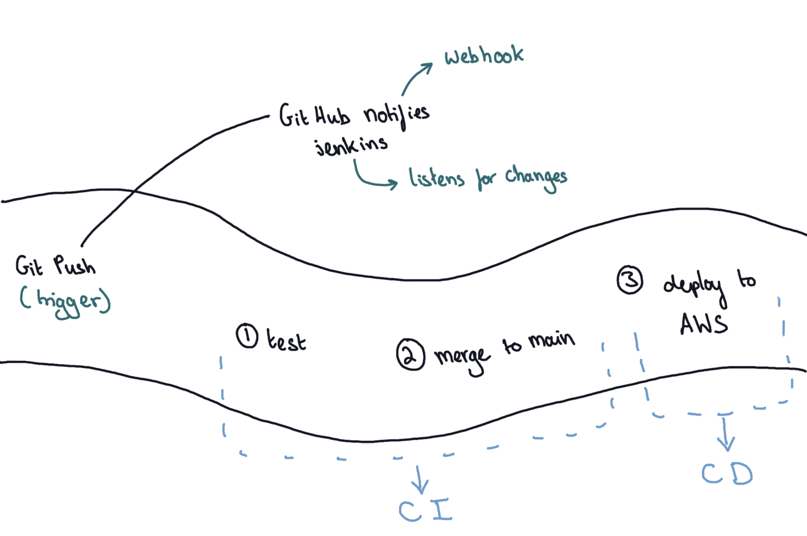
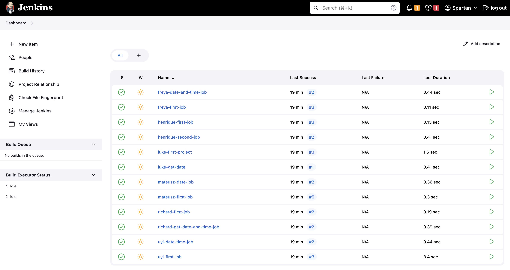

# Jenkins CICD

## Continous Intigration

The aim is to test the code before changes made on the dev branch are pushed to main. 

## Continous Delivery

Slower, as the deployment is manual.  
Delivers code that is ready to be deployed: in the form of artifacts e.g. jar file 

## Continous Deployment

Faster to get to users, as the deployment is automated. 
But may be more issues for the end user. 
Users have to understand that they need to report ongoing feedback to the developers. (a culture)

## CICD Pipeline

1. git push on the dev branch (trigger for the pipeline), github recieves the info
2. GitHub notifies Jenkins (webhook = when one service notifies anther service of a change) that there has been a change on the dev branch (Jenkins is listening for any changes)
3. Test the dev branch code
4. If tests pass, merge to main branch
5. Deploy the changes to AWS (update the code on the EC2 instance)

- For complex pipelines you might have many stages with multiple jobs within them.
- Jobs run conncurently

- Steps 3 and 4 are the continous intigration part
- Step 5 is the Continous Deployment.

### Why Pipeline?

- automation
- code quality
- saves time
- get the useable software into the hands of the end users (most important reason) - then can create value for a bussiness

## Jenkins

### Why Jenkins?

- Open-source and free
- Powerful plugins
- large community so many plugins
- industry standard, robust, been around a long time

## Jenkins CICD for our pipeline

1. Push dev branch to main branch on GitHub using SSH
2. GitHub will then notify Jenkins that a change has been made with a Webhook notification (Jenkins is listening)
   - Jenkins is made up of...
   -  the master mode/ built-in node: runs on its own virtual machine, can run jobs but not reccomended as it is not as expendable as the agent nodes
      -  Spins up/uses agent nodes
   -  agent nodes: as many as neccessary to run the jobs
3. Jobs
   1. test the code in the dev branch (test if it compiles), if succesful... 
   2. merge dev to main
   3. deploy the updated code to the EC2 instance on AWS
      Jenins will have to merge code on main branch, will need to SSH into both GitHub and the EC2 instance (.pem file)

## Detailed Steps

1. create key pair
   - freya-jenkins-2-github-jsonvh
2. public key to github
   - allow write access so we can merge the branches
3. Log in to jenkins (server 2)... credentials
4. New job
   - discard old builds
   - Max # of builds to keep = 3
   - build steps
   - execute shell (runs code on the agent node)
     - e.g. uname -a (finds details about opperating system)
   - save
5. dashboard

1. build now
2. Go to the job page and look at console output

### To set up a pipeline...

1. configure
2. post-build actions
3. build other projects
   - trigger only if build is stable 