# Jenkins CICD Pipeline Detailed Steps

1. Create key pair
   - freya-jenkins-2-github-jsonvh
2. Public key to github
   - allow write access so we can merge the branches
3. Log in to jenkins (server 2)... credentials

### Job 1

1. New Item
   
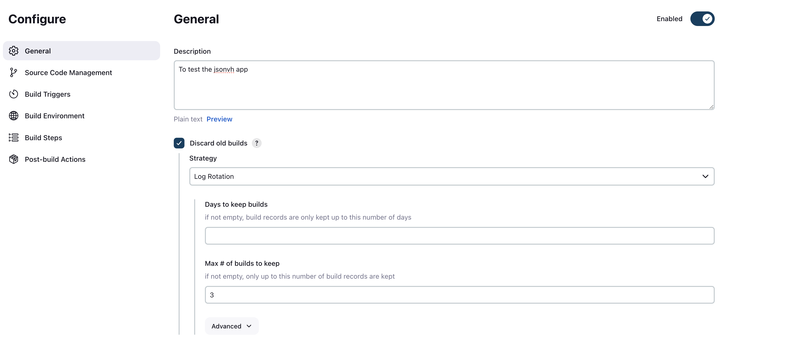

   - name = freya-jsonvh-job1-ci-test
   - freestyle project
   - desc: To test the jsonvh app
   - discard all builds, max 3
   - Check GitHub project, add HTTP url from GitHub repo: https://github.com/freyakavanagh/tech242-jsonvoorhees-app.git
   - Source code management: Git
      - URL: git@github.com:freyakavanagh/tech242-jsonvoorhees-app.git
         - Go to git hub rep and click 'code' and copy the SSH
   - Add credentials...

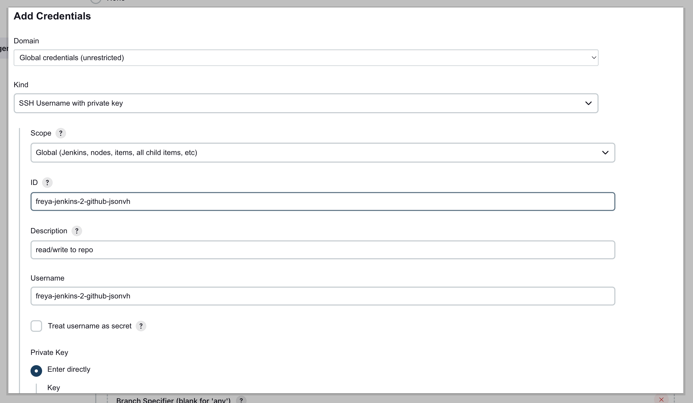

   - Kind: SSH username with private key
   - ID: freya-jenkins-2-github-jsonvh
   - Desc: read/write to repo
   - Username: freya-jenkins-2-github-jsonvh
   - enter directly
   - Then select from the credentials list
   - Branch specifier: */main
   - Build Steps
      - Invoke top level maven targets
         - version e.g. 3.6.3
         - Goals: package test (to rerun and test the code)
          - Advanced
            - POM:pom.xml
1. Run the job on the dashboard to test


### Set up Webhook to trigger job 1

1. In job1 configure
2. Build Triggers
3. Check GitHub hook trigger for GITScm polling
4. Change Branch specifier: */dev

On GitHub...

1. Go to the chosen repo
2. Settings
3. Webhooks
4. Add Webhook
   - Payload URL: http://52.31.15.176:8080/github-webhook/ (IP + port of jenkins server dashboard + github-webhook) 


In terminal...

1. Clone git repo to machine (using ssh)
2. git branch dev
3. git checkout dev
4. Go to readme file (nano README.md)
   - add something inside e.g. ##checking 
   - Control o and enter (to save)
   - Control x (to exit)
5.  git add .
6.  git commit -m "changed readme"
7.  git push origin main

On GitHub...

1. Check to see if it has pushed

On Jenkins...

1. Check to see if the job has been triggered

### Job 2

1. Add item <br>
2. name = freya-jsonvh-job1-ci-test<br>
   - freestyle project<br>
3. desc: To test the jsonvh app<br>
   - discard all builds, max 3
  
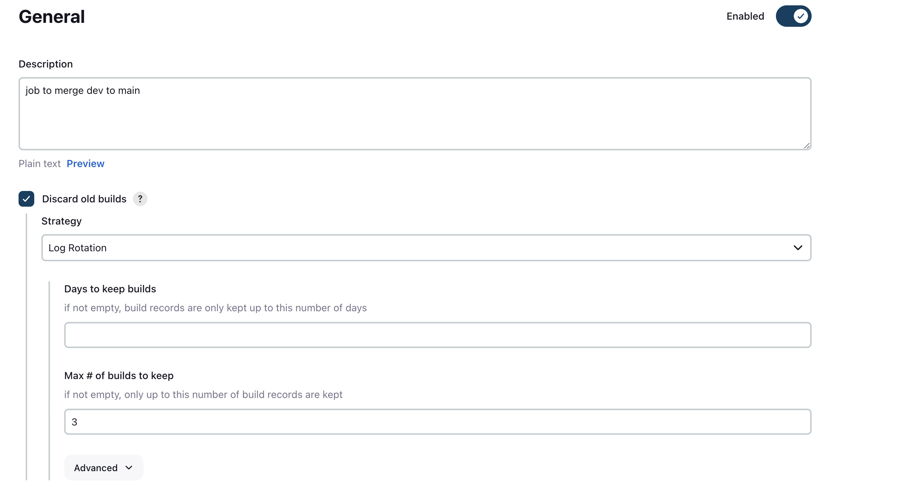


4. Check GitHub project, add HTTP url from GitHub repo: https://github.com/freyakavanagh/tech242-jsonvoorhees-app.git<br>
5. Source code management and select: Git<br>
   -  Repository URL: git@github.com:freyakavanagh/tech242-jsonvoorhees-app.git (SSH)<br>
6. Jenkins source code management<br>
7. Select the matching credentials <br>
8. In the "Branches to build" section, Branch Specifier = "*/dev"
   
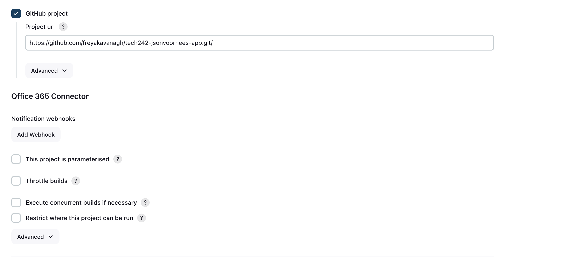   
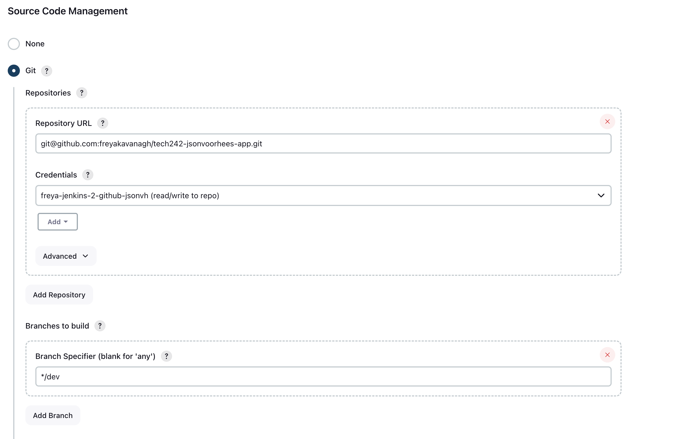
9.  Click "Add additional behaviours" and select "Merge before build"<br>
10. Enter Name of repository = origin<br>
11. Branch to merge to = main<br>
12. Jenkins additional behaviours<br>
13. Add post-build action, select Git publisher<br>
14. Tick Push Only If Build Succeeds and Merge Results

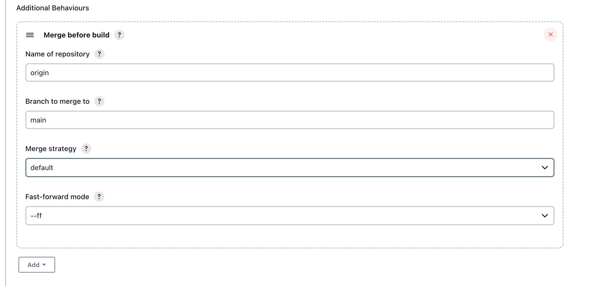

15. Click save

### Allowing Job 1 to Trigger Job 2

17. Navigate to the configure section for job 1<br>
18. Scroll to the bottom, click "Add post-build action" and select "Build other projects"<br>
19. Choose job 2 and set to "Trigger only if build is stable"

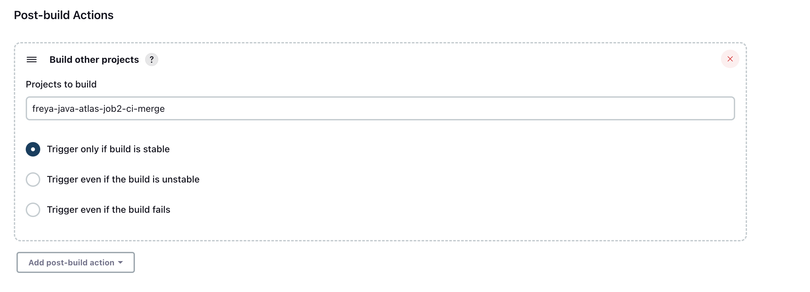


### Job 3

1. Deploy the application using an EC2 instance
2. Make sure the security group allows HTTP access and SSH access to Jenkins only
3. Create a new item...
   
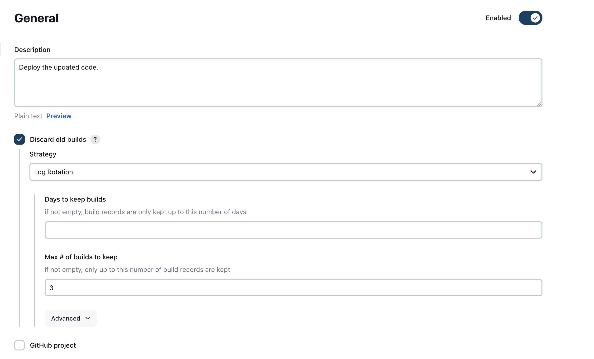

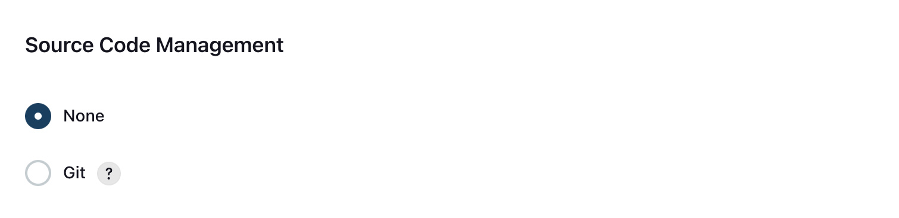

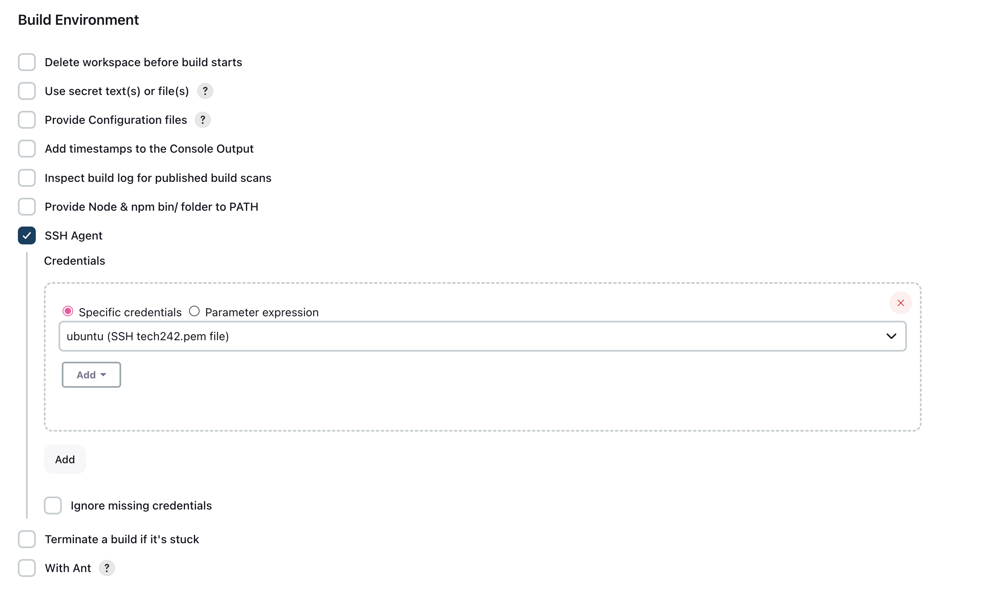

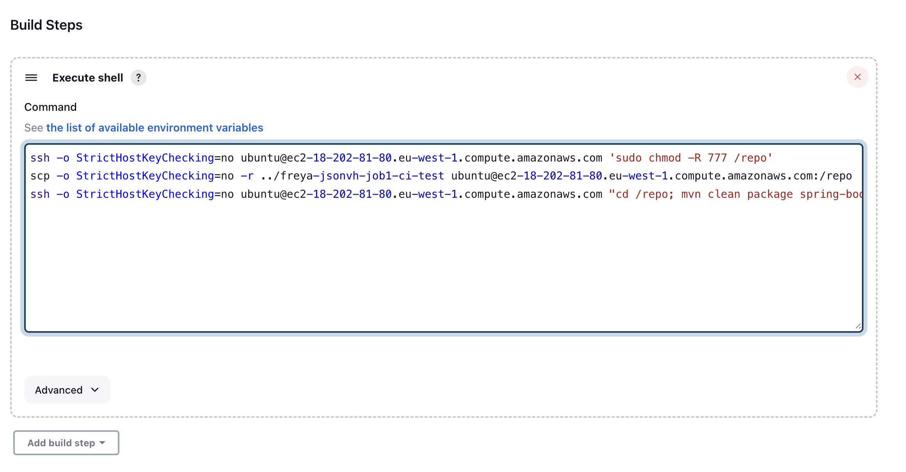

4. The text in Execute shell...

```
ssh -o StrictHostKeyChecking=no ubuntu@ec2-18-202-81-80.eu-west-1.compute.amazonaws.com 'sudo chmod -R 777 /repo'
scp -o StrictHostKeyChecking=no -r ../freya-jsonvh-job1-ci-test ubuntu@ec2-18-202-81-80.eu-west-1.compute.amazonaws.com:/repo
ssh -o StrictHostKeyChecking=no ubuntu@ec2-18-202-81-80.eu-west-1.compute.amazonaws.com "cd /repo; mvn clean package spring-boot:start"
```

#### Line 1 

- Connects to the EC2 instance as the user ubuntu
- Yhe option '-o StrictHostKeyChecking=no' disables strict host key checking
- 'sudo chmod -R 777 /repo' grands all permissions to everyone and the command has superuser privilages.


#### Line 2

- The SCP command copies the contents of the jenkins code you tested in job 2 '../freya-jsonvh-job1-ci-test' to the EC2 instance.
- It uses -o StrictHostKeyChecking=no to disable strict host key checking during the SCP operation.


#### Line 3

- Connects (SSH's) to the EC2 instance and executes the commands.
- The cd /repo changes the current directory to /repo.
- mvn clean package is a Maven command used to clean the project, compile the source code, and package it into a JAR or WAR file.
- spring-boot:start is a goal in the Spring Boot Maven Plugin that starts the Spring Boot application.

### Allowing Job 2 to Trigger Job 3

17. Navigate to the configure section for job 1<br>
18. Scroll to the bottom, click "Add post-build action" and select "Build other projects"<br>
19. Choose job 2 and set to "Trigger only if build is stable"

OR

ssh -o "StrictHostKeyChecking=no" ubuntu@ip <<EOF
cd /repo
mvn clean package spring-boot:start 
 EOF