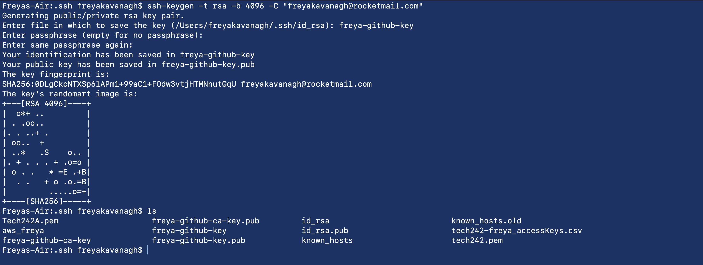
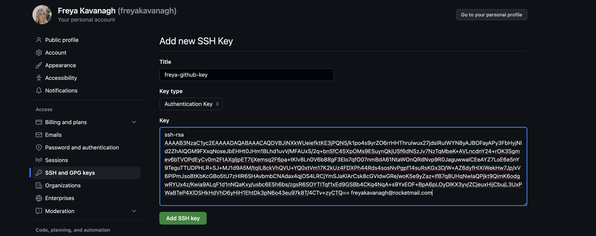

# SSH to Push to GitHub

SSH is superior to HTTPS when it comes to security as it uses a keypair rather than just a username and password.
    - Main issue is where you store the key pair

You can regenerate a public key from a private key, but not the other way around.
    - .pem file is the private key
    - public key can be stored on the website e.g. AWS

SSH is used to authenticate in many ways on many services. Jenkins needs SSH to authenticate e.g. EC2 instances

## SSH Key Steps

1. Generate a key pair in the SSH folder
2. Register the public key on GitHub
3. Add the private key to the SSH regiser
4. Create a test repo
5. Push changes to repo using SSH

## Detailed Steps

1. cd into .ssh
2. ssh-keygen -t rsa -b 4096 -C "freyakavanagh@rocketmail.com"
   - -t = type
   - -b = number of bytes
   - -C = email
3. Name the key e.g. freya-github-key
4. Press enter for no passphrase x2
5. .pub is the public key
   
   

6. Got to GitHub, settings, SSH and GPG Keys
7. Add new SSH Key
8. Match name to key folder, Authentication Key, Enter whole key (cat "name" in terminal)

9.  command in terminal .ssh file: eval `ssh-agent -s`
10. ssh-add key name
11. authenticate key: ssh -T git@github.com 

## To test...

1. set up new repo to test
2. create folder in terminal
3. initialise etc., push
